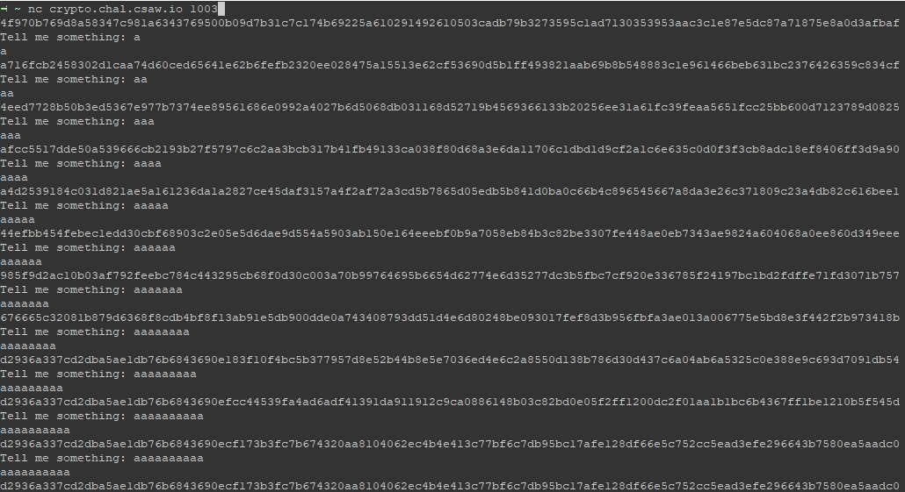
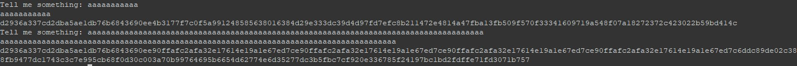
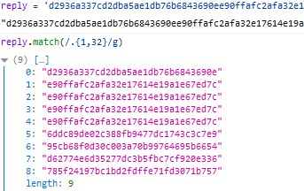
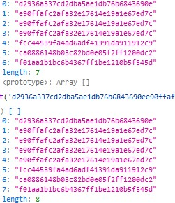
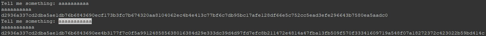
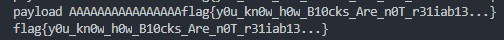

# byte_me (50 pts)

## Investigation
> nc 216.165.2.61 1003

When we connect to the site we are greeted with ciphertext. To attempt to guess the encryption used, we carefully enter input with increasing length.

At a certain input length, the ciphertext increases by 32 hex characters or 16 bytes. After many `A`'s later, we identify it as an ECB mode block cipher with 16Byte block size due to repeating blocks.

This is a good time to review how [ECB works](https://ctf101.org/cryptography/what-are-block-ciphers/).

> 2nd to 5th block repeats presumably due to the a's
---

## Layout discovery
So lets try to find out how our input and flag is being encrypted.

1. In the first picture, from the 1st `a` to the 9th `a`, we observe that the starting block is different. However from the 10th `a` onwards, it stays the same. Hence, we are able to ascertain that the length of the initial padding(we shall call it salt) is `16 - 9 = 7`

2. By trying `9*a + 16n*a`, we can see that the last 3 blocks are constant. To figure out the length of the last 3 blocks, we use `len(salt)a + x*a = 7a + xa` as input until we see an extra block. In my case, `x = 2`. We are able to calculate the length of the ending bytes with `16 + 16 + 16 - (2-1) = 45`. 

3. Everytime we reconnect to the server, the salt changes, while the ending bytes are constant, so by reasonable assumption the data layout is ` random | input | flag`.
___

## Byte-ing the flag

At this point, we are certain that by control the input, we are able to leak each character of the flag byte by byte due to how ECB works on every 16 byte chunks.

By padding the salt to 16 bytes, then adding 15 `a`'s, we can leak the first character of the flag X. For example, 

`AAAAAAAAAAAAAAAX = a77fecce505aac0f83b3a383b9112188`

Obviously we know the first character of the flag is `f`. But lets pretend we dont, so we brute force the flag by every character until we get

`AAAAAAAAAAAAAAAf = a77fecce505aac0f83b3a383b9112188`

We repeat this until we get the whole flag which takes quite some time.

`AAAAAAAAAAAAAAXX = ee90ffafc2afa32e17614e19a1e67ed7`

`AAAAAAAAAAAAAAfl = ee90ffafc2afa32e17614e19a1e67ed7`

A messily written solution is in this [same folder](solution.py)

