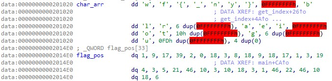

# beleaf (50 pts)



Code 
```py
flag_pos = [1,9,17,39,2,0,18,3,8,18,9,18,17,1,3,19,4,3,5,21,46,10,3,10,18,3,1,46,22,46,10,18,6]

char_arr = {
    0: 'w', 1: 'f', 2:'{', 3:'_', 4:'n', 5:'y', 6:'}', 8:'b',
    9: 'l', 10:'r', 17: 'a', 18: 'e', 19: 'i', 
    21: 'o', 22: 't', 39: 'g', 
    46: 'u'
}

print( ''.join([flag_pos.get(i) for i in idx_arr]) )

# flag : flag{we_beleaf_in_your_re_future}

```